# ⚡ Paradise Helper: CS2 AccPanel & Vision-Based AI Bot

**🎯 Paradise Helper is a powerful Windows desktop utility for managing and launching your Steam accounts, featuring an advanced vision-based AI Bot for CS2.**

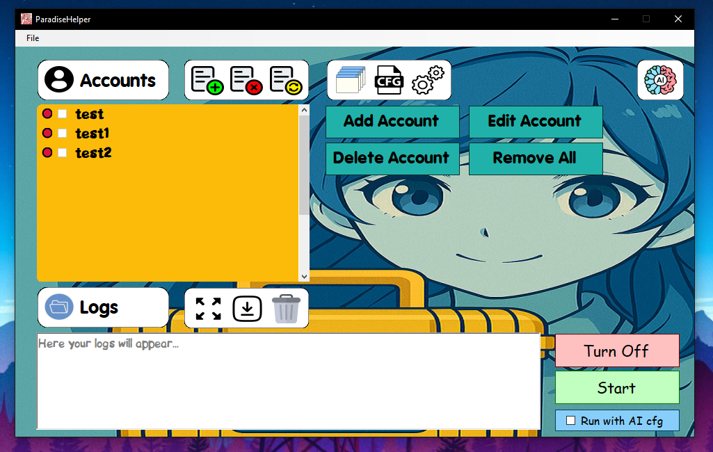

**🎯 The AI Bot works by analyzing the live OBS video feed instead of reading game memory, making it a fully external and non-intrusive tool.**

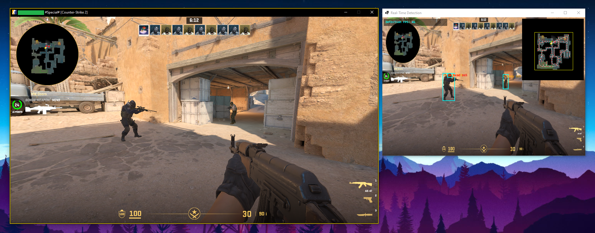

---

## ⚠️ Disclaimer (Read Before Using)

> **This tool is for educational and experimental purposes only.**  
> Using bots, automation, or third-party tools in CS2 violates the Terms of Service and **may result in permanent account bans**.  
> The developer is **not responsible** for lost, locked, or banned accounts.  
> **Use at your own risk.**

---

## 📋 Prerequisites

Before running Paradise Helper, make sure you have:

- **OS:** Windows 10 (not tested on other versions)  
- **.NET Runtime:** [.NET 8.0](https://dotnet.microsoft.com/en-us/download/dotnet/8.0)  
- **OBS Studio:** **Version 30.1.2 ONLY** (download [here](https://github.com/obsproject/obs-studio/releases/tag/30.1.2))  
- **OBS WebSocket:** Already built into OBS 30.1.2  
- **Steam Client** (required for launching CS2)  
- **Counter-Strike 2 installed**  

---

## 📦 Installation

1. Go to the **[Latest Release Page](https://github.com/1wintab/ParadiseHelper/releases/tag/v1.0.0)**.
2. Download the installer archive: [**`ParadiseHelper-1.0.0-x64-Setup.zip`**](https://github.com/1wintab/ParadiseHelper/releases/download/v1.0.0/ParadiseHelper-1.0.0-x64-Setup.zip) (from Assets).  
3. Extract the ZIP file and run the installer (`.exe`).  
4. Right-click **Paradise Helper.exe** → **Run as administrator** (after installation).

[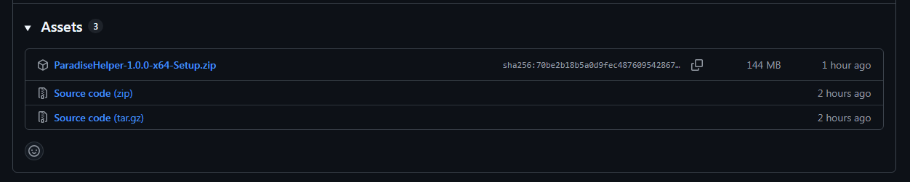](https://github.com/1wintab/ParadiseHelper/releases/tag/v1.0.0)

---

## ✨ Core Features

### 🗂️ Account Management  
- Add, edit, and delete Steam accounts  
- Import from `.txt` (login:password) or use manual entry  
- Mass delete support  
- Clear visual status indicators  

### 🚀 Smart Launcher  
- Select accounts to launch  
- Auto-login Steam → auto-start CS2  
- Manages both default launch and AI launch modes  

### 🤖 Vision-Based CS2 AI Bot  
- Uses OBS video feed (no memory reading)  
- Detects enemies through computer vision  
- Autonomous movement, aiming, shooting  
- Designed for **Deathmatch** on **Defusal Group Alpha** maps  

### ⚙️ Flexible Configuration  
- Full control over file paths  
- AI-specific launch parameters  
- OBS WebSocket settings  
- UI Tabs for real-time bot monitoring  

---

## 🧠 How the AI Bot Works

The **ParadiseHelper AI Bot** is built on a **fully external, vision-driven architecture** 👁️🤖✨

It **does not interact with the game's internal memory** — instead, it behaves like a **human watching the screen** and reacting to what it sees in real time 👀⚡

---

## ✔️ Key Advantages
- 🔒 **Safe** — no memory injection or internal hooks  
- 🎮 **Human-like** — works based only on visible information  
- 🔧 **Resilient** — UI changes rarely break functionality  

---

## 🔄 Vision Processing Pipeline

#### 1. 🎥 OBS Game Capture  
A live video feed of the game is captured through OBS and delivered to the helper in real time.

#### 2. 🔗 WebSocket Frame Stream  
OBS sends each captured frame over its built-in WebSocket server, allowing the helper to process frames instantly.

#### 3. 🧠 Computer Vision Analysis  
Every frame is analyzed using a combination of classical computer-vision techniques and machine-learning inference.  
The system identifies visual patterns, motion, and relevant in-frame objects.

#### 4. 🎮 Simulated Input Layer  
Based on the visual analysis, the system generates human-like mouse and keyboard actions.

---

## ⭐ Key Characteristics

- **Fully external workflow** — the system relies only on images captured from OBS  
- **No game memory usage** — no offsets, no scanning, no internal state access  
- **No injection or DLL hooking** — no modification of any external process  
- **Vision-based decision making** — every action is based solely on what the system “sees”  

---

# 🚀 How to Use (Step-by-Step)

Below is a fully structured guide with collapsible blocks + images.

---

## 1️⃣ Initial Setup  

<strong>⚙️ Initial Setup (click to expand)</strong>

---

### [ 🔧 1.1 Program Paths & OBS Connection ]

<strong>📂 Program Paths & OBS Setup</strong>

#### Step 1. ✔️ Run as Administrator:  
> Right-click **ParadiseHelper.exe** → **Run as administrator**

#### Step 2. ✔️ Set File Paths:  
> Go to "**⚙️ Settings → 📂 Paths**" and set paths for:  
- `steam.exe`  
- `cs2.exe`  
- `obs64.exe`  

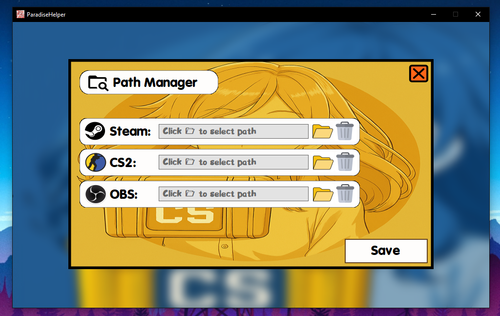

#### Step 3. ✔️ OBS WebSocket:  
> Go to "**⚙️ Settings → 🖥 OBS WebSocket**" and enter connection info:

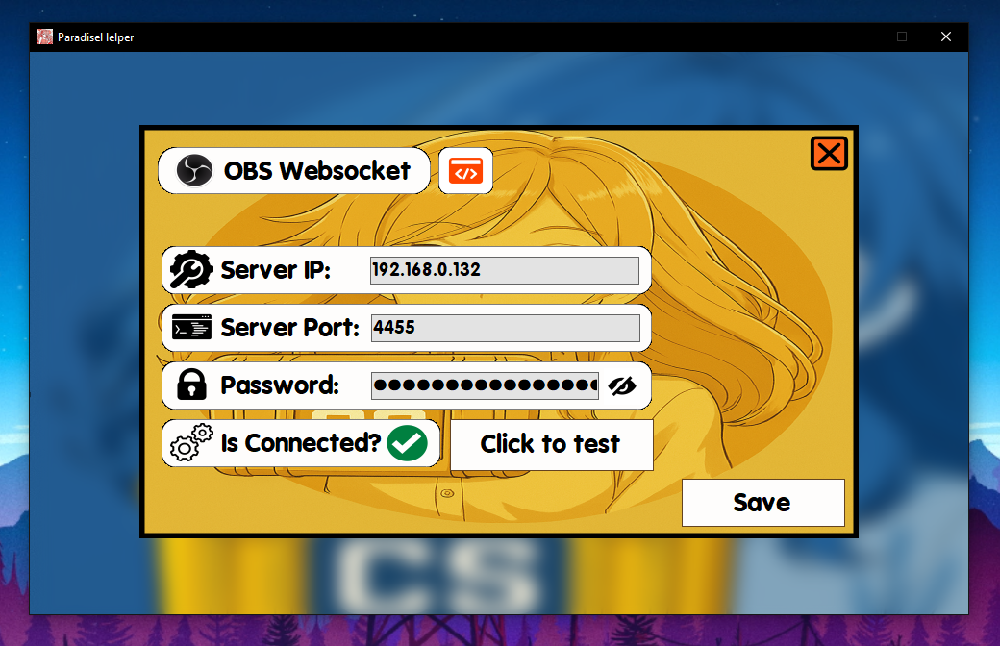

---

### [ 📡 1.2 OBS WebSocket Guide ] 

<strong>🌐 OBS WebSocket (connection info) — click to expand</strong>

#### Step 1. Go to "**Tools → WebSocket Server Settings**":
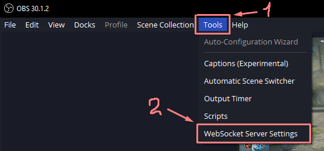

#### Step 2. Check the boxes **“Enable WebSocket Server”** and **“Enable Authentication”**, 
then click **“Show Connection Info”**:
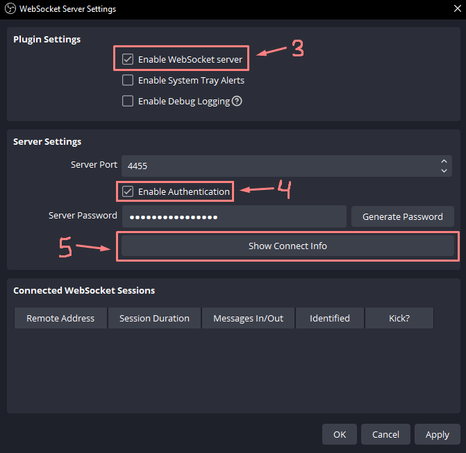

#### Step 3. Here you will find the **IP address, port, and password** required to connect:
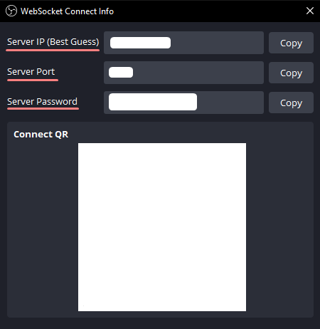

---

## 2️⃣ Adding Your Accounts  

➕ Click to expand Account Adding Guide

---

### 🔹 Part A — Adding Steam Accounts

#### Step 1 — Open Add Account Menu:
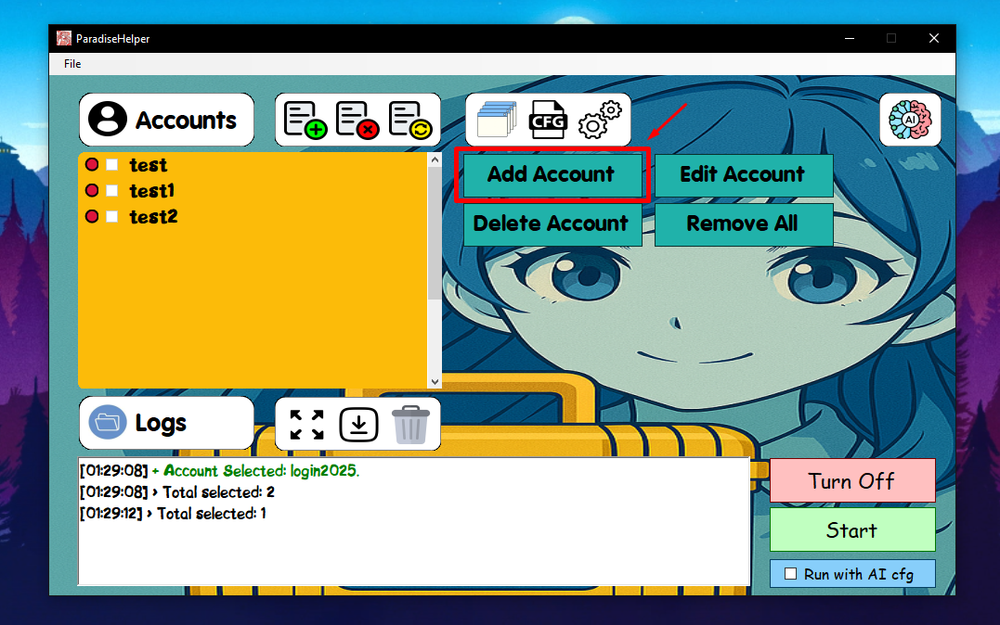

#### Step 2 — Choose a method:
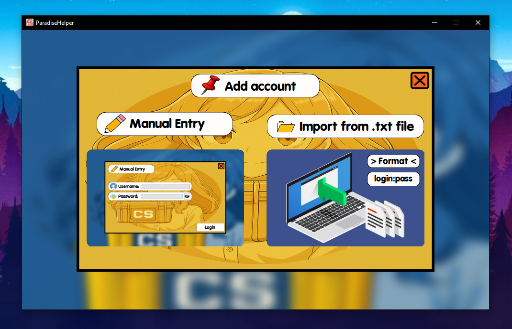

---

#### 📝 Method 1 — Manual Entry  

➕ Click to expand

#### Step 1 — Enter login, password and click **Save**: 
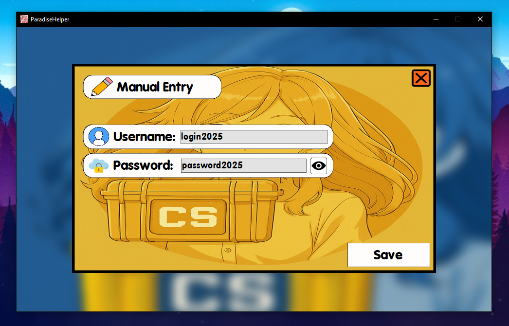

---

#### 📄 Method 2 — Import From .txt  

➕ Click to expand
  

**Accounts format:** `login:password`

#### Step 1 — Select the `.txt` file (formatted as `login:password`) and click **Open**: 
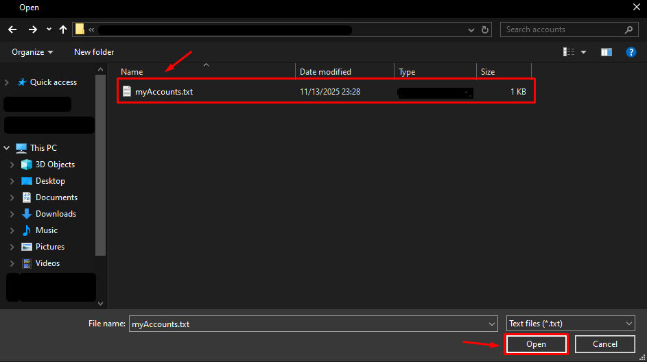

#### Step 2 — A message will appear confirming success or showing an error. Click **OK** to continue:  
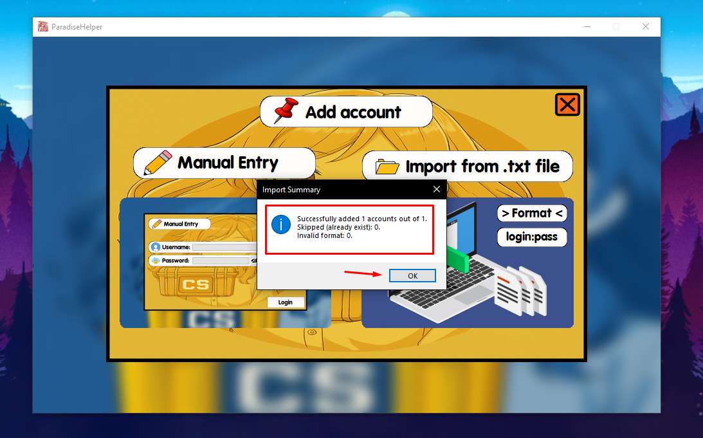

#### Step 3 — All successfully imported accounts will appear in the main menu: 
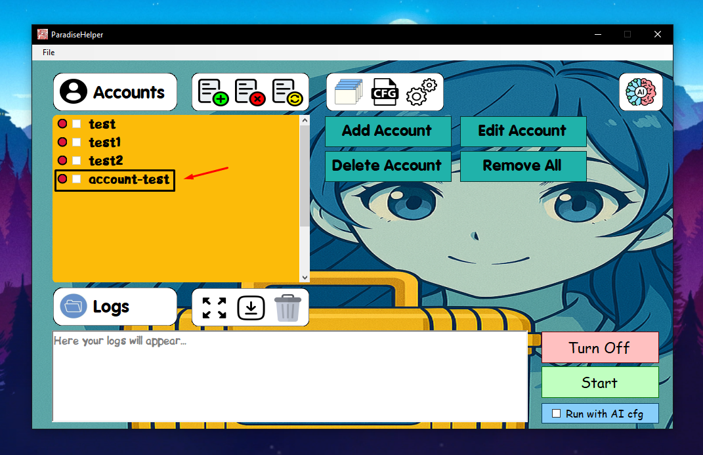

---

### 🔹 Part B — Adding MaFiles (2FA)

#### Step 1 — Go to Settings:  
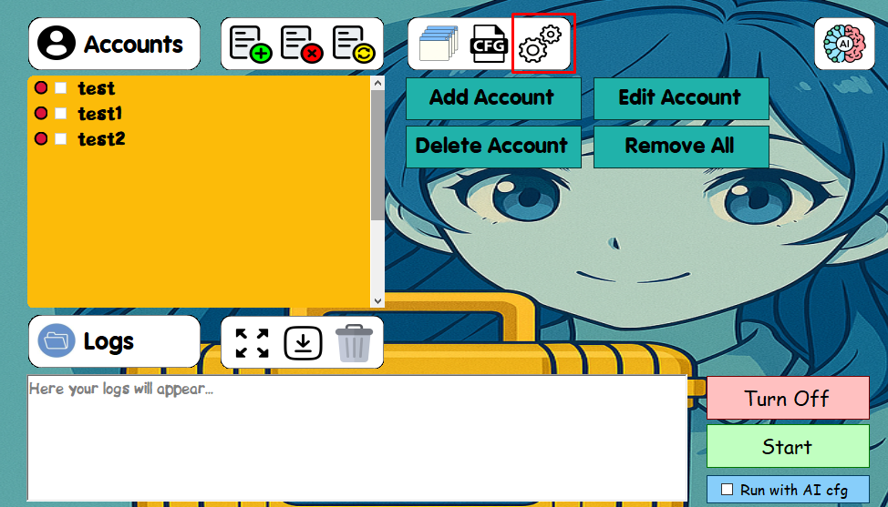

#### Step 2 — Open “MaFiles (2FA)”:  
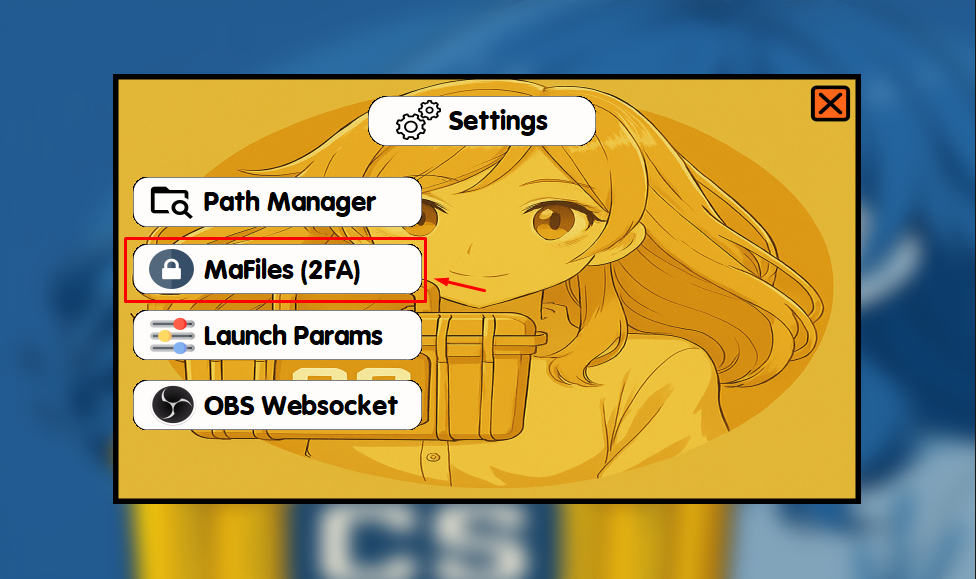

#### Step 3 — Click “Open Folder” and paste your *.maFile files:  
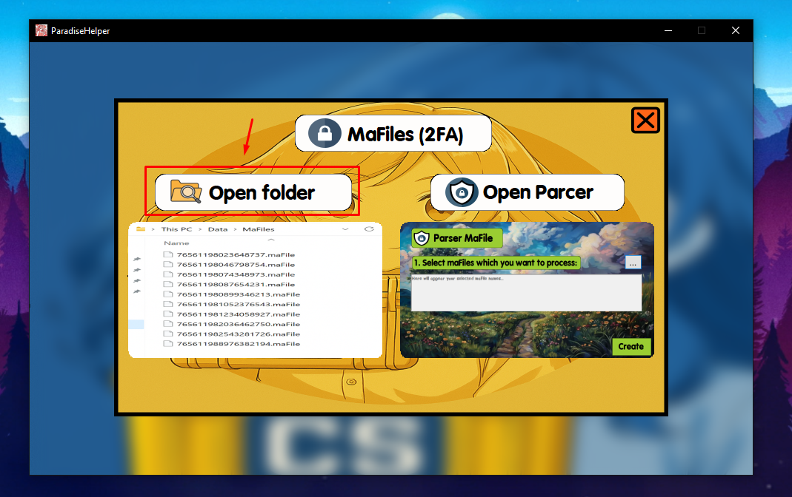

---

## 3️⃣ Launching the AI Bot  

🤖 Click to expand AI Launch Guide

#### Step 1 — **Select the account** you want to run  
#### Step 2 — **Enable** the option **Run in AI cfg**  
#### Step 3 — Click **Start** to begin the automated launch sequence  

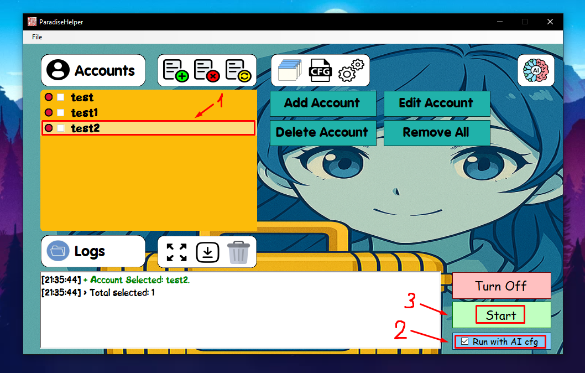
---

### 🎯 Status Explanation

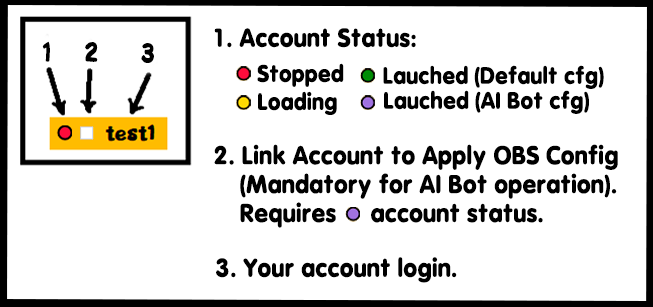

- **Purple status** → CS2 is fully loaded and the AI Bot is ready  
- **Green status** → CS2 launched in *Default Mode* (AI mode was not enabled)

> **Important:**  
> If the status becomes **green**, it means **Run in AI cfg** was not enabled.  
>  
> To fix this:  
> 1. Close the account (click its row)  
> 2. Re-launch using the correct steps:  
>    - Select account  
>    - Tick **Run in AI cfg**  
>    - Press **Start**

---

### 🟪 When the Status Turns Purple

Once the account reaches **purple status**, it means:
- CS2 has fully launched  
- The account entered the game  
- The AI launch configuration was applied correctly  

At this point, **enable the checkbox** next to the account to mark it as the active source for OBS video processing:

---

### 🎥 OBS Capture Initialization

After the checkbox is enabled, the helper automatically begins preparing OBS for AI usage.  
Specifically, it starts configuring and detecting the correct game capture source.

You will see log messages such as:

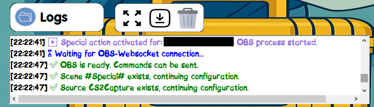

This process ensures that:
- OBS is capturing the correct CS2 window  
- The video feed resolution is detected  
- The game viewport is validated for AI analysis  

---

### ✨ AI Bot Ready State

When OBS is fully prepared, the helper will display the message: "**✨ AI Bot is ready for use.**"

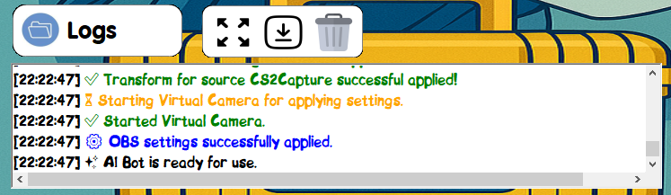

- OBS Virtual Camera is actively outputting the CS2 gameplay  
- The Vision AI Bot has access to the **live game video stream via the OBS Virtual Camera**  
- All preprocessing steps (frame capture, scaling, color normalization) are complete  
- You can safely open the AI debugging tools  

---

### 🖥️ Example of the Correct OBS Setup

Below is an example of OBS + CS2 capture configured correctly for the Vision AI Bot pipeline:

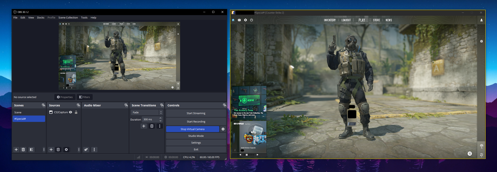

The Virtual Camera output allows the bot to:
- Receive the real-time gameplay feed  
- Detect enemies using computer vision  
- Track movement and scenario changes  
- Execute actions based purely on what it “sees”

---

### 📡 Open AIForm & Start the Vision Bot

After selecting the active account:

1. Go to the **AIForm** tab  
2. Click **Open AI Debug Form** to start monitoring the real-time AI vision and logic  

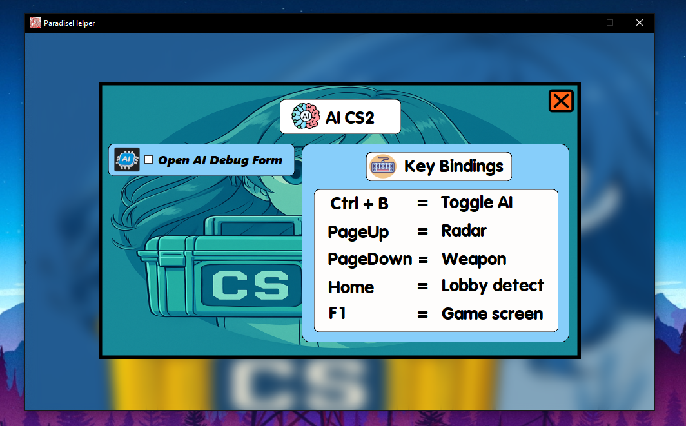

---

## 4️⃣ In-Game AI Behavior  

🎮 Click to expand Behavior Rules

### ✔ Supported Game Mode
The AI Bot operates **exclusively** in **Deathmatch** mode.

### ✔ Supported Maps
- Dust2  
- Mirage  
- Inferno  

### ❗ Unsupported Map
- **Vertigo**  
  - If loaded into Vertigo, the bot will automatically leave and search for a supported map.

### 🔁 Automatic Queue Handling
- If left in the lobby, the bot automatically queues into Deathmatch.

### 🎮 Hotkey Control
- **Ctrl + B** — Toggle the AI Bot ON/OFF at any time  
  (This pauses or resumes AI logic without leaving the match)

---

# 🖼️ Full UI Gallery  

📸 Click to open Gallery

### 1️⃣ Setup & Configuration  
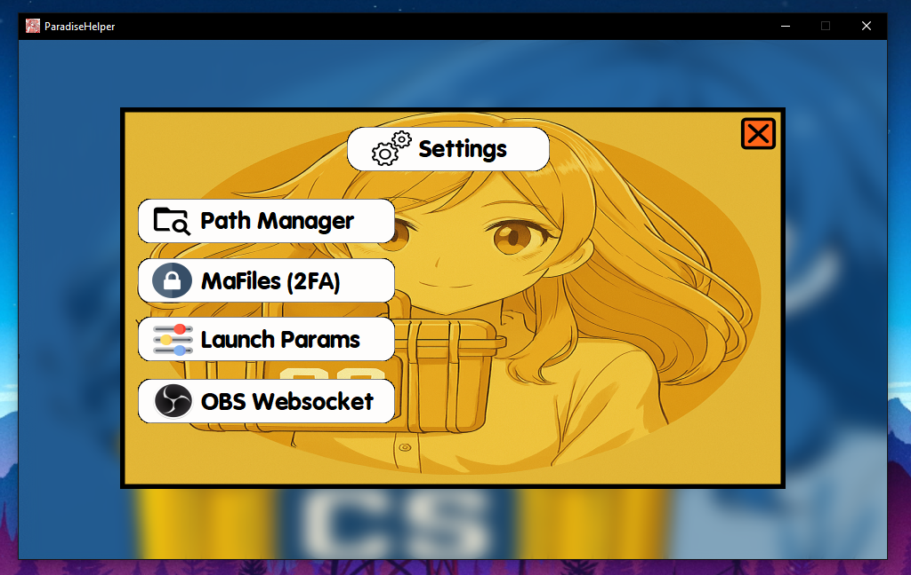  
  

---

### 2️⃣ Account Management  
  
  
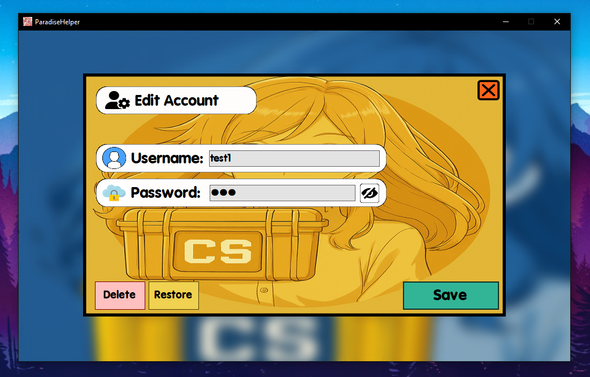  
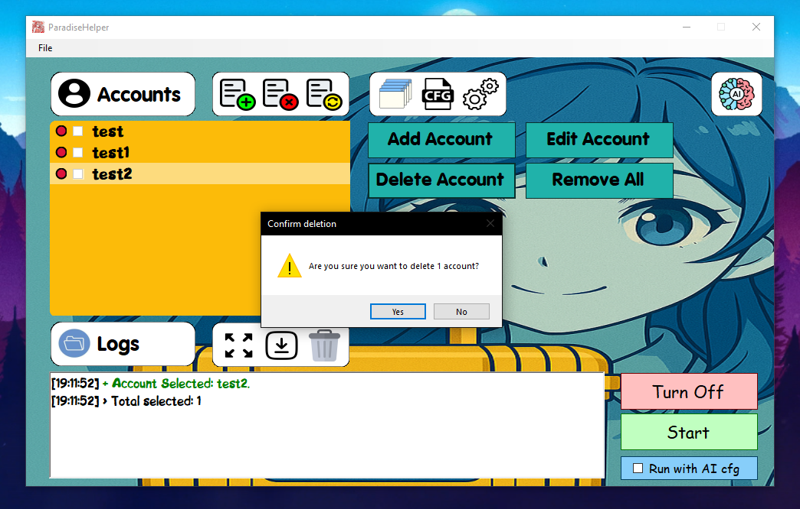  
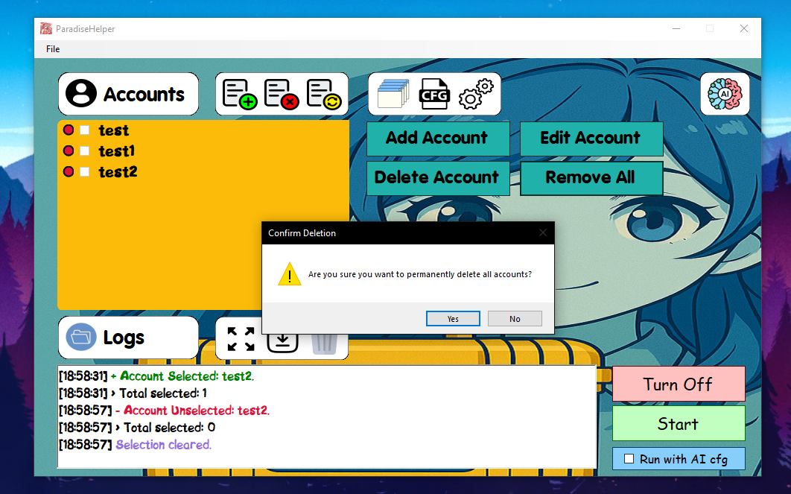

---

### 3️⃣ Launch Modes & AI  
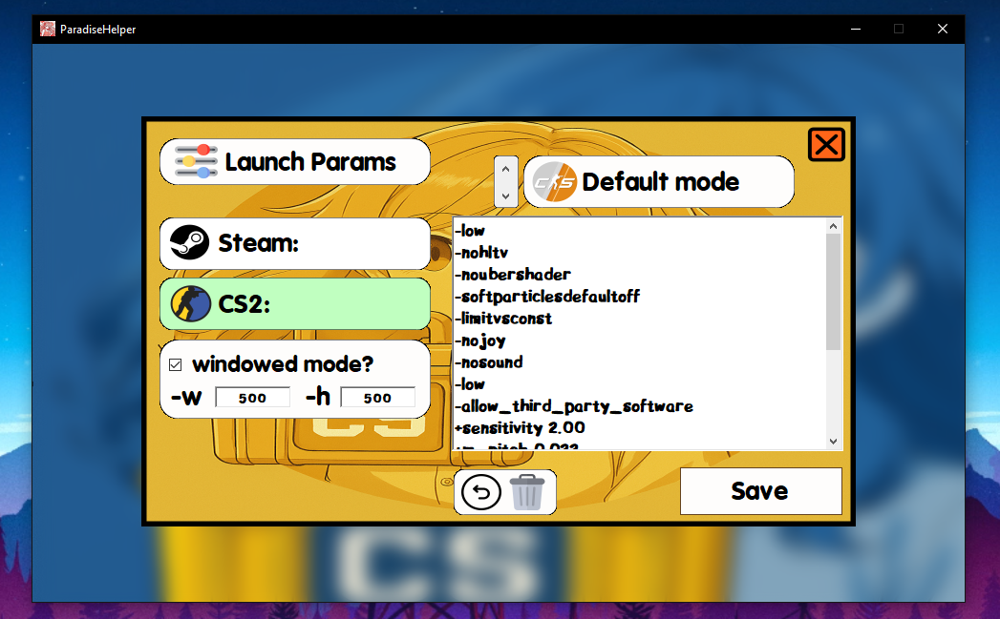  
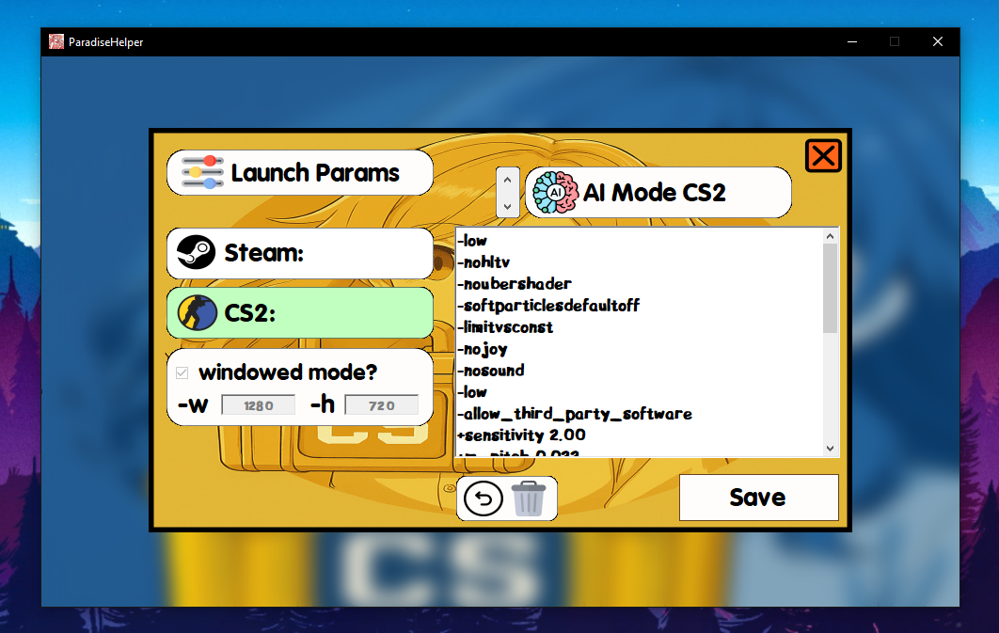  

---

### 4️⃣ UI Reference & Bot in Action  
  
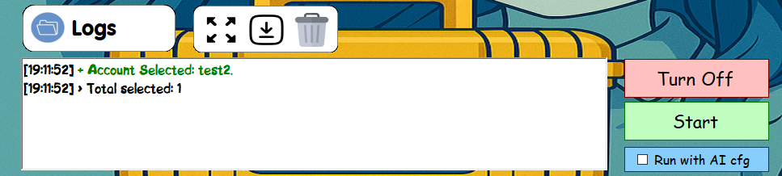  
  
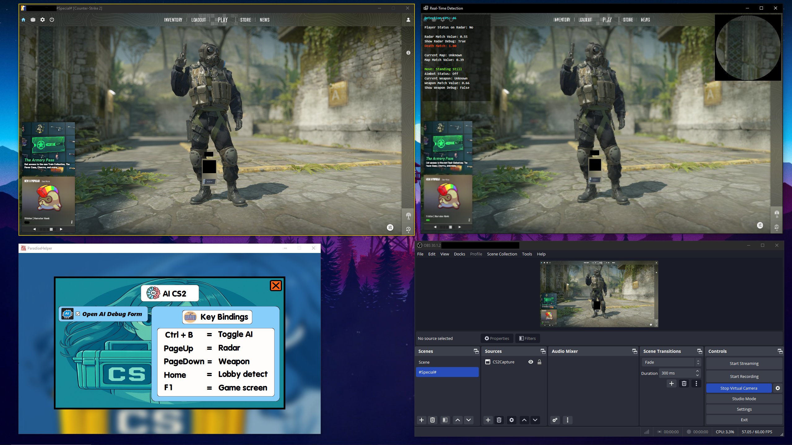

---

# 💻 Tech Stack

- **Framework:** .NET 8  
- **Language:** C#  
- **UI:** WinForms  
- **Computer Vision:** OpenCvSharp4, Emgu.CV  
- **AI Runtime:** ONNX Runtime (DirectML / Managed)  
- **OBS Integration:** obs-websocket-dotnet  
- **Input Simulation:** InputSimulatorCore  
- **Graphics:** SharpDX, Vortice.*  
- **Database:** SQLite  
- **Utilities:** Newtonsoft.Json  

---

# ⚠️ Final Warning

This software is provided **“as is”** for educational use.  
The developer is **not responsible** for bans, data loss, or misuse.  
**You assume all risk.**
